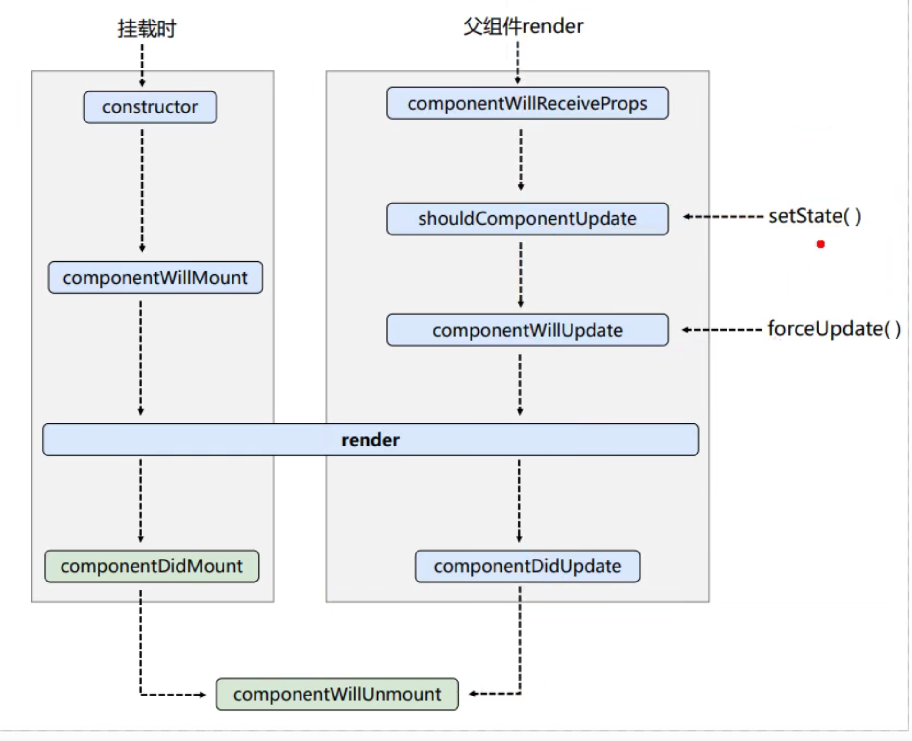

# React LifeCycle -- old

1. 初始化
    ```
   constructor => componentWillMount => render => componentDidMount
   ```

2. 更新
    1) 内部组件 `this.setState()`:
       ```ecmascript 6
       shouldComponentUpdate => componentWillUpdate => render => componentDidUpdate
       ```
       
    2) 内部组件 `this.forceUpdate()`:
       ```ecmascript 6
       componentWillUpdate => render => componentDidUpdate
       ```
    3) 父组件的 `render()`:
        ```ecmascript 6
       componentWillReceiveProps => shouldComponentUpdate => componentWillUpdate => render => componentDidUpdate
       ```
3. 卸载

   由`ReactDOM.unmountComponentAtNode()`触发
   ```ecmascript 6
    componentWillUnmount()
    ```

### 注：
一般在`componentDidMount()` 中做初始化的事情，如：开启定时器、发送网络请求、订阅消息等

在`componentWillUnmount()` 中做一些收尾的事情，如：关闭定时器、取消订阅消息



# LifeCycle -- New
1. 初始化阶段： 由`ReactDOM.render()`触发-- 初次渲染
    1) `constructor()`
    2) `getDerivedStateFromProps()`
    3) `render()`
    4) `componentDidMount()`
2. 更新阶段：由组件内部`this.setState()`或父组件更新`render`触发
    1) `getDerivedStateFromProps()`
    2) `shouldComponentUpdate()`
    3) `render()`
    4) `getSnapshotBeforeUpdate()`
    5) `componentDidUpdate()`
3. 卸载：由`ReactDOM.unmountComponentAtNode()`触发
    1) `componentWillUnmount()`

### 注：
一般在`componentDidMount()` 中做初始化的事情，如：开启定时器、发送网络请求、订阅消息等

在`componentWillUnmount()` 中做一些收尾的事情，如：关闭定时器、取消订阅消息

